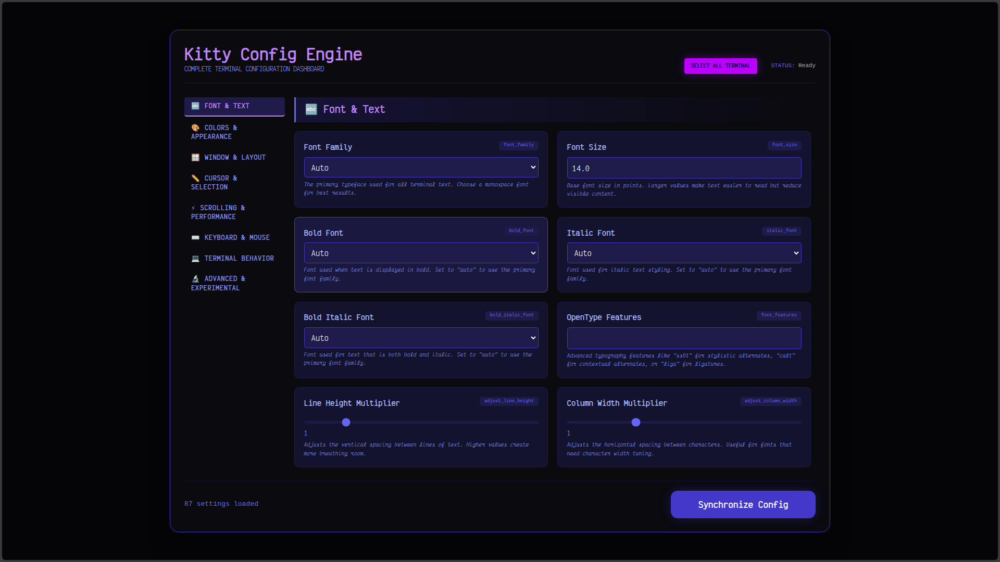

# Kitty Config Engine

> A beautiful, comprehensive GUI for configuring Kitty terminal - because editing config files manually should be optional.

[](https://opensource.org/licenses/MIT)
[](http://makeapullrequest.com)
[](https://github.com/Freedomwithin/kitty-config-gui)

<p align="center">
  
</p>



## Features

### Complete Coverage
- **80+ settings** across 7 intuitive categories
- **16 standard colors** plus special colors (cursor, selection, URLs)
- **Font management** with auto-discovery of system fonts
- **Performance tuning** (scrollback, repaint delay, input delay)
- **Window & layout controls** (padding, margins, opacity, sizing)

### Visual & User-Friendly
- **Color pickers** with hex display - no more guessing hex codes
- **Range sliders** for numeric values with real-time feedback
- **Toggle switches** for boolean settings
- **Dropdown menus** for predefined options
- **Clear descriptions** explaining what each setting actually does

### Safe & Non-Destructive
- **Automatic backups** - every change creates a timestamped backup
- **Preserves comments** - your manual config notes stay intact
- **Hot reload** - changes apply instantly without restarting Kitty
- **No config corruption** - precise regex updates only target specific settings

### Performance
- **Lightweight** - minimal resource usage
- **Instant updates** - changes apply in milliseconds
- **Offline first** - runs entirely on your machine, no internet required

## Screenshot

<div align="center">
  
  <br/>
  <em>The Kitty Config Engine dashboard - all settings at your fingertips</em>
</div>

## Quick Start

### One-Click Install (Recommended)

```bash
curl -sSL https://raw.githubusercontent.com/Freedomwithin/kitty-config-gui/main/scripts/install.sh | bash
```

### Manual Install

```bash
# Clone the repository
git clone https://github.com/Freedomwithin/kitty-config-gui.git
cd kitty-config-gui

# Install dependencies
npm install

# Launch the application
./scripts/start_kitty_config_gui.sh
```

The dashboard will open automatically at `http://localhost:3040`

### Desktop Integration

To add Kitty Config Engine to your application launcher:

```bash
# Install desktop entry
./scripts/install-desktop.sh
```

This will create a desktop launcher with the icon in your applications menu.

## System Requirements

- **Linux** (or macOS with XQuartz)
- **Node.js** v14.0 or higher
- **Kitty** terminal (obviously!)
- **Modern browser** (Chrome, Firefox, Edge, or Safari)

## Package Managers

### Arch Linux (AUR)
```bash
yay -S kitty-config-gui
```

### Homebrew (macOS)
```bash
brew tap Freedomwithin/kitty-config-gui
brew install kitty-config-gui
```

### Debian/Ubuntu (PPA)
```bash
sudo add-apt-repository ppa:Freedomwithin/kitty-config-gui
sudo apt update
sudo apt install kitty-config-gui
```

## Why This Exists

Kitty has **over 200 configuration options**. While powerful, this makes it:

- **Overwhelming** for new users
- **Time-consuming** to find specific settings
- **Error-prone** when editing manually
- **Difficult** to experiment with colors

This GUI solves all of that by providing:

- **Discoverability** - see all settings in one place
- **Visual feedback** - see colors and values immediately
- **Safety** - backups mean you can experiment freely
- **Speed** - change settings 10x faster than editing config files

## How It Works

```
+-------------+     +--------------+     +-------------+
|   Browser   | <-> |  Node.js API | <-> | Kitty.conf  |
|   (React)   |     |  (Express)   |     |  (File)     |
+-------------+     +--------------+     +-------------+
                          |
                    +-------------+
                    |  Kitty      |
                    |  (SIGUSR1)  |
                    +-------------+
```

1. **Read**: Parses your existing `~/.config/kitty/kitty.conf`
2. **Edit**: Dashboard provides visual controls for all settings
3. **Sync**: Writes changes back with regex precision
4. **Reload**: Sends SIGUSR1 signal to Kitty for instant refresh

## Development

### Project Structure

```
kitty_config_gui/
├── assets/
│   ├── kitty_config_gui_icon.png      # App icon
│   └── kitty_config_gui_sample.png    # Screenshots
├── backend/
│   ├── server.js                      # Express API server
│   └── kitty-schema.js                # All 80+ settings definitions
├── frontend/
│   └── public/
│       └── index.html                 # React UI (no build step!)
├── scripts/
│   ├── start_kitty_config_gui.sh      # Launcher script
│   └── install-desktop.sh             # Desktop entry installer
├── kitty_config.desktop.template      # Desktop entry template
├── package.json
└── README.md
```

### Add New Settings

1. Edit `backend/kitty-schema.js`
2. Add your setting to the appropriate category
3. Define the setting type (color, boolean, range, select, text, number, font-select)
4. Provide a clear description
5. The UI automatically adapts!

```javascript
{
  type: 'color',
  label: 'My New Color',
  default: '#ff0000',
  description: 'What this color does'
}
```

## Contributing

Contributions are welcome! Here's how:

1. **Fork** the repository
2. **Create** a feature branch (`git checkout -b feature/amazing`)
3. **Commit** your changes (`git commit -m 'Add amazing feature'`)
4. **Push** to the branch (`git push origin feature/amazing`)
5. **Open** a Pull Request

### Areas We Need Help

- [ ] **Theme presets** - Add popular terminal themes
- [ ] **Live preview** - Show a mini terminal
- [ ] **Export/Import** - Share configs with others
- [ ] **More settings** - Add any we missed
- [ ] **Packaging** - Help with distribution packages
- [ ] **Documentation** - Improve user guide
- [ ] **Testing** - Add test coverage

## License

MIT License - see [LICENSE](LICENSE) file for details.

## Credits

- **Kovid Goyal** - Creator of Kitty terminal
- **Jonathon & Maya** - Project creators
- **Contributors** - All the amazing people who help improve this tool

## Community

- **Issues**: [GitHub Issues](https://github.com/Freedomwithin/kitty-config-gui/issues)
- **Discussions**: [GitHub Discussions](https://github.com/Freedomwithin/kitty-config-gui/discussions)
- **Reddit**: [r/KittyTerminal](https://www.reddit.com/r/KittyTerminal/)

## Pro Tips

1. **Keyboard Shortcut**: Add this to your Kitty config for quick access:
   ```
   map ctrl+shift+g launch --type=overlay --cwd=current /path/to/kitty-config-gui/scripts/start_kitty_config_gui.sh
   ```

2. **Desktop Integration**: Run `./scripts/install-desktop.sh` to add to your app launcher

3. **Backup Management**: Backups are saved as `kitty.conf.bak_YYYY-MM-DDTHH:MM:SS`

4. **Troubleshooting**: Check `.gui_log.txt` in the project directory for debug output

---

**Made with ❤️ by [Jonathon](https://github.com/Freedomwithin) & [Maya](https://github.com/Freedomwithin/maya.ai-sovereign)**

*"Because terminals should be beautiful AND easy to configure"*
